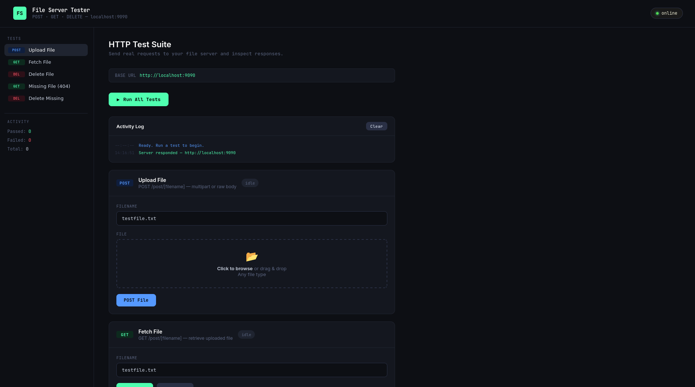

# This project has been created as part of the 42 curriculum by zbakour, arajma, lazmoud.



## Description

* webserv is a multi-server HTTP/1.0 implementation configured via a single config file. It supports GET, POST, and DELETE methods, serves static files, and executes CGI scripts in any language with a standard I/O interface — Python, PHP, Node.js, C, and more.

## Instructions

### Prerequisites
* `c++`
* `make`

---

### Build

```bash
make
```

This compiles all sources and produces the `webserv` binary in the current directory.

---

### Usage

```bash
./webserv [Config_file]
```

 **Example:** 

```bash
./webserv server.conf
```

---

### Makefile Targets

| Target | Description |
|---|---|
| `make` / `make all` | Compile all sources and produce the `webserv` binary |
| `make clean` | Remove compiled object files ( `.build/` ) |
| `make fclean` | Remove object files, build directory, and the binary |
| `make re` | Full recompile — equivalent to `fclean` + `all` |
| `make run` | Build (if needed) and launch `webserv` with no arguments |
| `make test` | Build (if needed) and launch `webserv` with `Test.conf` |

---

### Notes

* Object files are cached under `.build/` — incremental builds only recompile changed files
* Compiled with `-Wall -Wextra -Werror` — warnings are treated as errors
* Headers are resolved from `./include/`
* before running the actual server you need to have configuration file, if not then it will just use the default at `./conf/default` you can take it as a refrence.

## Resources
* [Hypertext Transfer Protocol -- HTTP/1.0](https://www.w3.org/Protocols/HTTP/1.0/spec.html)
* [The Common Gateway Interface (CGI) Version 1.1](https://datatracker.ietf.org/doc/html/rfc3875)
* [gemini](https://gemini.google.com/) 

### Ai Usage
* it was specifically used to learn how some aspects of the projects work, like Cgi, Multiplexing, HTTP/1.0. 
* it was used to make boilerplate copy pasta code that was just copied anyways. like http error codes and error code phrases, and also mime type to extension mappings. ex: video/mp4, audio/mp3.
* it was also used to create testing pages and scripts inside `./www/cgi-bin`, `./www/scripts`, and `./www/html`
